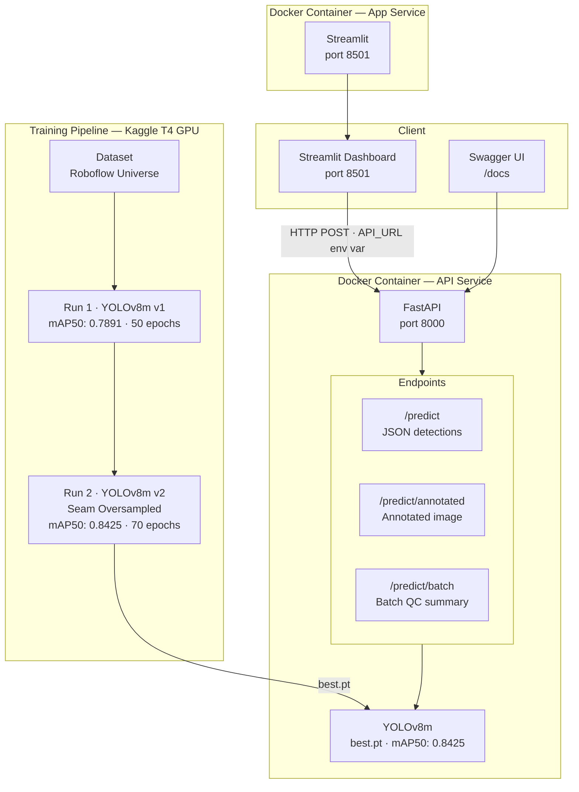

# Fabric Defect Detector

<div align="center">


An end-to-end automated fabric defect detection system for Bangladesh's RMG industry.  
Detects 5 defect classes in real time using YOLOv8m, served via a production-grade FastAPI backend and an interactive Streamlit QC dashboard — fully containerized with Docker.

[Live Demo](https://huggingface.co/spaces/ashik297/fabric-defect-detector) · [API Docs](#api-reference) · [Model Results](#model-performance)

</div>

---

## Table of Contents

- [Problem Statement](#problem-statement)
- [Key Features](#key-features)
- [System Architecture](#system-architecture)
- [Project Structure](#project-structure)
- [Defect Classes](#defect-classes)
- [Model Performance](#model-performance)
- [Tech Stack](#tech-stack)
- [Quick Start](#quick-start)
- [API Reference](#api-reference)
- [Deployment](#deployment)
- [Results](#results)
- [Author](#author)

---

## Problem Statement

Bangladesh is the world's second-largest garment exporter, contributing over **$47 billion** in annual exports. Manual fabric quality inspection remains a major bottleneck — it is slow, inconsistent, and difficult to scale.

This project delivers an AI-powered automated QC system that detects fabric defects in real time using computer vision, enabling RMG factories to reduce waste, improve throughput, and maintain export quality standards.

---

## Key Features

- 5-class real-time defect detection: Stain, Thread, Warp/Weft, Hole, Seam
- YOLOv8m (medium variant) achieving **mAP50 = 0.8425** on the held-out test set
- REST API with three endpoints: single predict, annotated image, batch QC
- Interactive Streamlit dashboard with per-class confidence breakdown and batch mode
- Fully Dockerized — single command to run the entire platform locally
- Live demo hosted on Hugging Face Spaces (Streamlit-only, no backend required)
- Two training runs with seam class oversampling in v2 to address class imbalance

---

## System Architecture



> **Note:** The [live demo on Hugging Face Spaces](https://huggingface.co/spaces/ashik297/fabric-defect-detector) runs a simplified Streamlit-only version with direct YOLO inference — no FastAPI backend. The full production stack (FastAPI + Streamlit + Docker) is in this repository and is intended for local or self-hosted deployment.

---

## Project Structure

```
fabric-defect-detector/
│
├── api/
│   ├── main.py                          # FastAPI entrypoint — 3 endpoints
│   └── requirements.txt
│
├── app/
│   ├── dashboard.py                     # Streamlit QC dashboard
│   ├── requirements.txt
│   └── .streamlit/
│       └── config.toml
│
├── data/
│   ├── raw/                             # Original Roboflow dataset
│   └── processed/                       # Train/val/test splits (YOLO format)
│
├── models/
│   └── best.pt                          # YOLOv8m v2 weights (52 MB)
│
├── notebooks/
│   ├── 01_training_v1.ipynb             # v1 baseline training
│   ├── 02_training_v2_oversampled.ipynb # v2 seam oversampling + training
│   ├── diagnosis.ipynb                  # Class distribution analysis
│   └── evaluation.ipynb                 # Test set evaluation
│
├── Results/
│   ├── Run-1/                           # v1 metrics, curves, confusion matrix
│   └── Run-2-over-sampled/              # v2 metrics + oversample_seam.py
│
├── sample_images/
├── src/
│
├── Dockerfile.api
├── Dockerfile.app
├── docker-compose.yml
├── .dockerignore
├── .gitignore
└── requirements.txt
```

---

## Defect Classes

| Class | Description |
|-------|-------------|
| Stain | Oil, chemical, or dirt contamination on fabric surface |
| Thread | Loose or broken thread visible on fabric |
| Warp_Weft | Structural weaving defects (warp/weft errors) |
| hole | Physical holes or tears in fabric |
| seam | Seam-related defects (underrepresented in v1; oversampled in v2) |

Seam class suffered from severe class imbalance in v1. Run 2 applied targeted oversampling via `oversample_seam.py` (3× duplication of seam-containing images), which was the primary driver of the +5.34% mAP50 improvement.

---

## Model Performance

### Run Comparison

| Metric | Run 1 — v1 Baseline | Run 2 — v2 Oversampled |
|--------|---------------------|------------------------|
| mAP50 | 0.7891 | **0.8425** |
| mAP50-95 | — | 0.5425 |
| Precision | — | 0.8595 |
| Recall | — | 0.8022 |
| Model | YOLOv8m | YOLOv8m |
| Epochs | 50 | 70 |
| Hardware | Kaggle T4 GPU | Kaggle T4 GPU |

### v2 Per-Class AP50 (Test Set)

| Class | AP50 |
|-------|------|
| Stain | 0.8410 |
| Thread | 0.9055 |
| Warp_Weft | 0.8442 |
| hole | 0.9004 |
| seam | 0.7212 |

Full metrics, precision-recall curves, and confusion matrices are in [`Results/Run-2-over-sampled/`](./Results/Run-2-over-sampled/).

---

## Tech Stack

| Layer | Technology |
|-------|-----------|
| Model | YOLOv8m (Ultralytics) |
| Backend | FastAPI + Uvicorn |
| Frontend | Streamlit |
| Containerization | Docker + Docker Compose |
| Training | Kaggle (T4 GPU) |
| Dataset | Roboflow Universe |
| Live Demo | Hugging Face Spaces |
| Language | Python 3.10 |

---

## Quick Start

### Docker Compose (Recommended)

```bash
git clone https://github.com/rahhhmann/Fabric-Defect-Detector.git
cd Fabric-Defect-Detector
docker-compose up --build
```

| Service | URL |
|---------|-----|
| Streamlit Dashboard | http://localhost:8501 |
| FastAPI Backend | http://localhost:8000 |
| Swagger UI | http://localhost:8000/docs |

### Manual Setup

```bash
# Terminal 1 — API
cd api
pip install -r requirements.txt
uvicorn main:app --reload --port 8000

# Terminal 2 — Dashboard
cd app
pip install -r requirements.txt
API_URL=http://localhost:8000 streamlit run dashboard.py
```

---

## API Reference

### `POST /predict`

Returns JSON with bounding boxes, class labels, and confidence scores.

```bash
curl -X POST "http://localhost:8000/predict" \
  -F "file=@sample_images/test.jpg"
```

```json
{
  "detections": [
    {
      "class": "Stain",
      "confidence": 0.91,
      "bbox": [120, 85, 340, 210]
    }
  ],
  "total_defects": 1,
  "inference_time_ms": 47.3
}
```

### `POST /predict/annotated`

Returns the input image with bounding boxes rendered — suitable for direct display.

```bash
curl -X POST "http://localhost:8000/predict/annotated" \
  -F "file=@sample_images/test.jpg" \
  --output annotated.jpg
```

### `POST /predict/batch`

Accepts multiple images, returns per-image defect counts and an aggregate QC summary.

```bash
curl -X POST "http://localhost:8000/predict/batch" \
  -F "files=@img1.jpg" \
  -F "files=@img2.jpg"
```

Full interactive documentation is available at `/docs` (Swagger UI).

---

## Deployment

### Live Demo — Hugging Face Spaces

A Streamlit-only version (direct YOLO inference, no FastAPI) is publicly hosted at:

**[https://huggingface.co/spaces/ashik297/fabric-defect-detector](https://huggingface.co/spaces/ashik297/fabric-defect-detector)**

The HF Spaces version was built to work around free-tier RAM constraints (512 MB) on platforms that require a separate backend service. The full FastAPI + Docker stack in this repository is the production-intended architecture.

### Self-Hosted (Full Stack)

1. Fork this repository
2. Provision a server with at least **1 GB RAM** (the model weights alone are ~52 MB; inference requires headroom)
3. Install Docker and Docker Compose
4. Run:
   ```bash
   docker-compose up --build -d
   ```
5. Set `API_URL` environment variable on the dashboard service if deploying API and dashboard on separate hosts

---

## Results

Training artifacts are versioned under the `Results/` directory:

- `Results/Run-1/` — v1 baseline: metrics CSV, training curves, confusion matrix
- `Results/Run-2-over-sampled/` — v2 final: metrics CSV, PR curves, `oversample_seam.py`

---

## Author

**Ashikur Rahman**  
Final-year CSE, Patuakhali Science and Technology University  
GitHub: [rahhhmann](https://github.com/rahhhmann) · HuggingFace: [ashik297](https://huggingface.co/ashik297)

---

## License

This project is licensed under the [MIT License](LICENSE).
