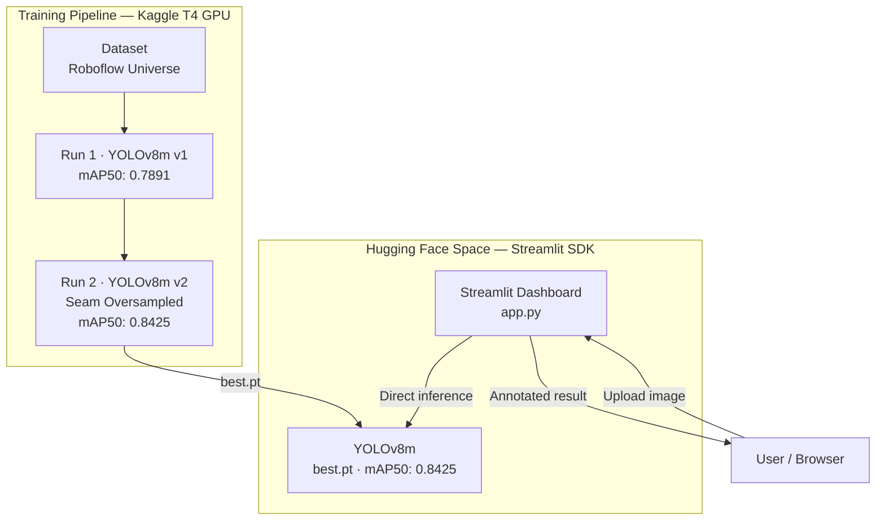

# Fabric Defect Detector

<div align="center">


An end-to-end automated fabric defect detection system for Bangladesh's RMG industry.  
Detects 5 defect classes in real time using YOLOv8m, served via an interactive Streamlit QC dashboard.

[Live Demo](https://huggingface.co/spaces/ashik297/fabric-defect-detector) · [Model Results](#model-performance)

</div>

---

## Table of Contents

- [Problem Statement](#problem-statement)
- [Key Features](#key-features)
- [System Architecture](#system-architecture)
- [Project Structure](#project-structure)
- [Defect Classes](#defect-classes)
- [Model Performance](#model-performance)
- [Tech Stack](#tech-stack)
- [Quick Start](#quick-start)
- [Deployment](#deployment)
- [Results](#results)
- [Author](#author)

---

## Problem Statement

Bangladesh is the world's second-largest garment exporter, contributing over **$47 billion** in annual exports. Manual fabric quality inspection remains a major bottleneck — it is slow, inconsistent, and difficult to scale.

This project delivers an AI-powered automated QC system that detects fabric defects in real time using computer vision, enabling RMG factories to reduce waste, improve throughput, and maintain export quality standards.

---

## Key Features

- 5-class real-time defect detection: Stain, Thread, Warp/Weft, Hole, Seam
- YOLOv8m (medium variant) achieving **mAP50 = 0.8425** on the held-out test set
- Direct YOLO inference inside Streamlit — no separate backend required
- Interactive QC dashboard with per-class confidence breakdown and batch mode
- Two training runs with seam class oversampling in v2 to address class imbalance
- Fully Dockerized for local development — single command to run

---

## System Architecture



---

## Project Structure

```
fabric-defect-detector/
│
├── app.py                               # Streamlit app — direct YOLO inference
├── requirements.txt
│
├── models/
│   └── best.pt                          # YOLOv8m v2 weights (52 MB)
│
├── data/
│   ├── raw/                             # Original Roboflow dataset
│   └── processed/                       # Train/val/test splits (YOLO format)
│
├── notebooks/
│   ├── 01_training_v1.ipynb
│   └── 02_training_v2_oversampled.ipynb
│
├── Results/
│   ├── Run-1/                           # v1 metrics, curves, confusion matrix
│   └── Run-2-over-sampled/              # v2 metrics + oversample_seam.py
│
├── sample_images/
│
├── docker-compose.yml                   # Local dev only
├── Dockerfile
├── .dockerignore
└── .gitignore
```

---

## Defect Classes

| Class | Description |
|-------|-------------|
| Stain | Oil, chemical, or dirt contamination on fabric surface |
| Thread | Loose or broken thread visible on fabric |
| Warp_Weft | Structural weaving defects (warp/weft errors) |
| Hole | Physical holes or tears in fabric |
| Seam | Seam-related defects (underrepresented in v1; oversampled in v2) |

Seam class suffered from severe class imbalance in v1. Run 2 applied targeted oversampling via `oversample_seam.py`, which was the primary driver of the +5.34% mAP50 improvement.

---

## Model Performance

### Run Comparison

| Metric | Run 1 — v1 Baseline | Run 2 — v2 Oversampled |
|--------|---------------------|------------------------|
| mAP50 | 0.7891 | **0.8425** |
| Model | YOLOv8m | YOLOv8m |
| Seam Recall | Low | Improved |
| Epochs | 50 | 70 |
| Hardware | Kaggle T4 GPU | Kaggle T4 GPU |

### v2 Test Set — Overall & Per-Class Results

| Metric | Value |
|--------|-------|
| mAP50 | **0.8425** |
| mAP50-95 | 0.5425 |
| Precision | 0.8595 |
| Recall | 0.8022 |

| Class | AP50 |
|-------|------|
| Stain | 0.8410 |
| Thread | 0.9055 |
| Warp_Weft | 0.8442 |
| hole | 0.9004 |
| seam | 0.7212 |

Full metrics, precision-recall curves, and confusion matrices are in [`Results/Run-2-over-sampled/`](./Results/Run-2-over-sampled/).

---

## Tech Stack

| Layer | Technology |
|-------|-----------|
| Model | YOLOv8m (Ultralytics) |
| Frontend | Streamlit |
| Containerization | Docker + Docker Compose (local) |
| Training | Kaggle (T4 GPU) |
| Dataset | Roboflow Universe |
| Deployment | Hugging Face Spaces (Streamlit SDK) |
| Language | Python 3.10 |

---

## Quick Start

### Local — Docker (Recommended)

```bash
git clone https://github.com/rahhhmann/Fabric-Defect-Detector.git
cd Fabric-Defect-Detector
docker-compose up --build
```

Dashboard available at `http://localhost:8501`.

### Local — Manual

```bash
pip install -r requirements.txt
streamlit run app.py
```

---

## Deployment

Live on Hugging Face Spaces (Streamlit SDK):

**[https://huggingface.co/spaces/ashik297/fabric-defect-detector](https://huggingface.co/spaces/ashik297/fabric-defect-detector)**

### Deploy Your Own Space

1. Fork this repository
2. Create a new Space on [huggingface.co/spaces](https://huggingface.co/spaces) — SDK: **Streamlit**
3. Push the repo contents to the Space repository
4. Ensure `models/best.pt` is committed (use Git LFS for files > 10 MB)
5. The Space builds from `requirements.txt` and runs `app.py` automatically

---

## Results

Training artifacts are versioned under the `Results/` directory:

- `Results/Run-1/` — v1 baseline: metrics CSV, training curves, confusion matrix
- `Results/Run-2-over-sampled/` — v2 final: metrics CSV, PR curves, `oversample_seam.py`

---

## Author

**Ashikur Rahman**  
Final-year CSE, Patuakhali Science and Technology University  
GitHub: [rahhhmann](https://github.com/rahhhmann) · HuggingFace: [ashik297](https://huggingface.co/ashik297)

---

## License

This project is licensed under the [MIT License](LICENSE).
